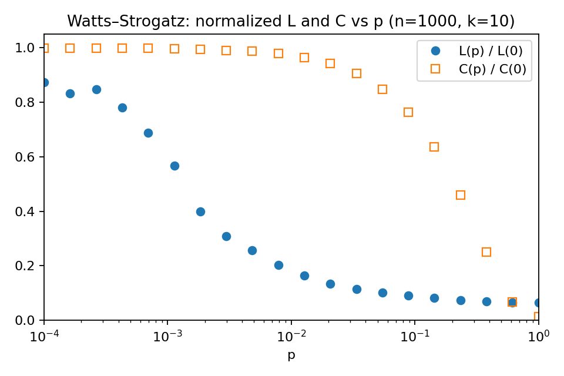

# Small-World (Watts–Strogatz)

Este diretório contém um experimento reproduzível do modelo de pequeno-mundo de Watts–Strogatz (WS). O script varre valores de probabilidade de reconexão `p` e mede:

- Comprimento médio de caminho característico L
- Coeficiente médio de aglomeração C
- Versões normalizadas L/L(0) e C/C(0)

Os resultados são salvos em `small-world/out/` como CSV e uma figura PNG.

## Arquivos
- `ws_experiments.py`: implementação do experimento WS.
- `out/`: diretório de saída para resultados (`ws_results.csv`) e plot (`ws_LC_vs_p.png`).
- `requirements.txt`: dependências específicas para este módulo.

## Ambiente
Você pode usar o Python do projeto raiz ou criar um ambiente dedicado para este módulo.

### Opção A: ambiente dedicado

```bash
python3 -m venv .venv
source .venv/bin/activate
pip install -U pip
pip install -r small-world/requirements.txt
```

### Opção B: usar requisitos da raiz
Se você já instalou os requisitos da raiz do repositório, provavelmente já tem as dependências necessárias.

## Como executar
A partir da raiz do repositório:

```bash
python -m small-world.ws_experiments
```

Ou diretamente dentro do diretório `small-world/`:

```bash
python ws_experiments.py
```

Por padrão:
- `n = 1000` nós
- `k = 10` grau total no anel (deve ser par)
- `p` em 20 valores log-espalhados de 1e-4 até 1
- `num_trials = 20` amostras por ponto

Saídas em `small-world/out/`:
- `ws_results.csv`: colunas `p, L, C, L_over_L0, C_over_C0`
- `ws_LC_vs_p.png`: gráfico semilog de L/L0 e C/C0 vs p

## Resultado



## RELATÓRIO FINAL

- [Relatório de métricas (Markdown)](./RESPOSTAS.md)

## Customização
Edite a dataclass `WSParams` em `ws_experiments.py` para mudar parâmetros, por exemplo:

```python
WSParams(num_nodes=500, lattice_k=8, num_trials=10, p_values=np.logspace(-4, 0, 15))
```

## Notas
- `lattice_k` precisa ser par para `networkx.watts_strogatz_graph`.
- Se o grafo sorteado não for conexo (caso raro), o script usa a maior componente para calcular L.
